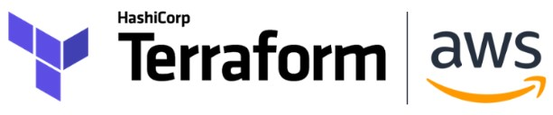

# IAC Ingestão de dados S3
 
 
 
Infraestrutura como código (IaC) através do Terraform para provisionamento de um bucket S3 e posterior ingestão de dados (ENADE 2017) a partir de uma URL para este bucket.

* Terraform
* Fonte de dados ENADE 2017
* Bucket S3
* Python
* Python boto3 (lib)
